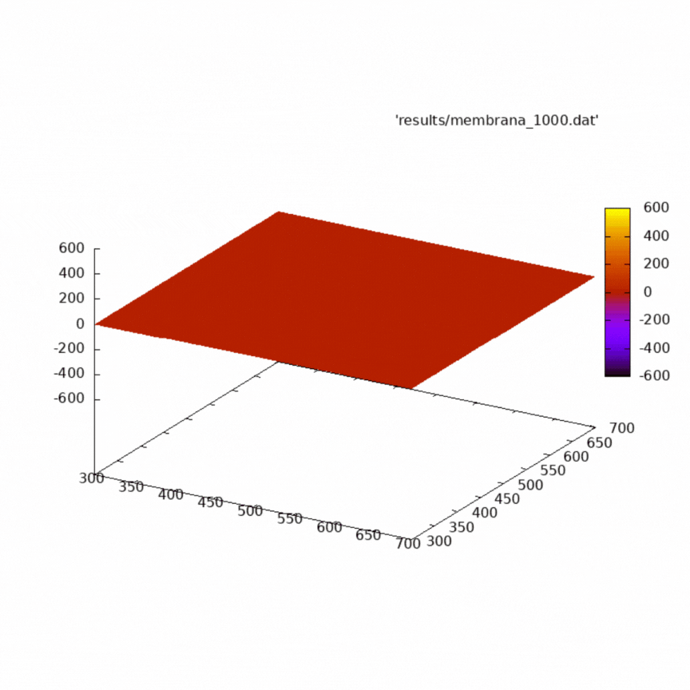
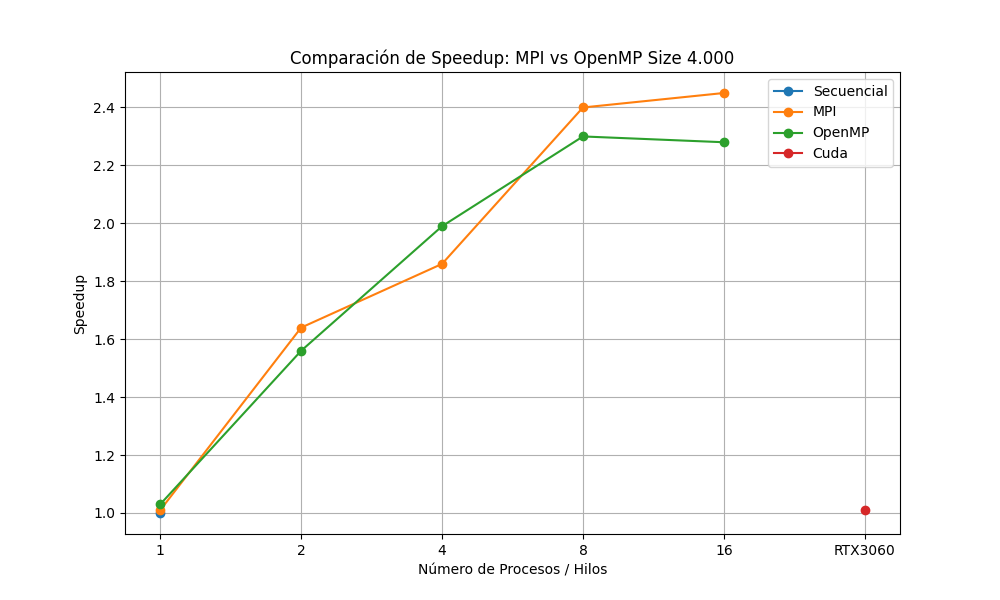
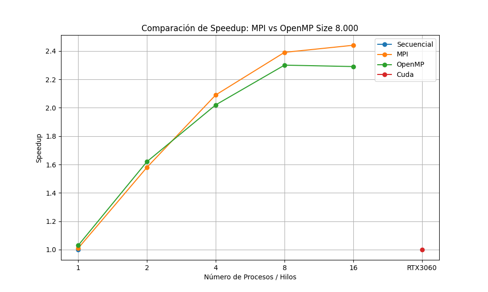

# Estudio de la Paralelización de la Ecuación de Onda 

En este proyecto se resuelve la ecuación de onda bidimensional para simular el efecto de la caída de gotas en una superficie de agua. Para ello, se utiliza una discretización de cuarto orden, lo que permite transformar la ecuación diferencial parcial de la que partimos en un sistema algebraico. En términos prácticos, esto implica calcular una matriz que contiene las perturbaciones del fluido en cada punto del dominio, actualizada iterativamente para cada instante de tiempo.

Dado que este tipo de simulaciones puede ser computacionalmente muy exigente, especialmente en dominios de tamaño mediano o grande, se implementan técnicas de paralelización utilizando OpenMP, MPI y OpenACC (CUDA). Se realiza un estudio comparativo del rendimiento mediante el análisis de speedups, tomando como referencia el tiempo de ejecución del código secuencial. En el gif de debajo se muestran los resultados sobre una pequeña parte de la supericie considerada para las simulaciones.



Para los métodos basados en CPU, se evalúan los speedups obtenidos al utilizar 1, 2, 4, 8 y 16 hilos, permitiendo comparar la eficiencia de la paralelización en distintos niveles de concurrencia. Para medir el tiempo de ejecución se utiliza un archivo sh en el que se mide el tiempo de ejecución completo del archivo compilado. Debido a que la salida es una matriz de un tamaño demasiado grande para mostrarlo por terminal como salida se guarda en un archivo DAT.

## Discretización

La ecuación de onda bidimensional que se busca resolver es:

    ∂²u/∂t² = c² (∂²u/∂x² + ∂²u/∂y²)

Para resolverla numéricamente, se discretiza tanto en el tiempo como en el espacio.

### Discretización espacial (Laplaciano de cuarto orden)

Se usa un esquema de diferencias finitas de cuarto orden para aproximar el segundo derivado espacial:

    ∂²u/∂x² ≈ (-u[i-2] + 16*u[i-1] - 30*u[i] + 16*u[i+1] - u[i+2]) / (12 * Δx²)

De forma análoga para ∂²u/∂y². La suma de ambas da el Laplaciano ∇²u:

    ∇²u ≈ [(-u[i-2][j] + 16*u[i-1][j] - 30*u[i][j] + 16*u[i+1][j] - u[i+2][j]) +
            (-u[i][j-2] + 16*u[i][j-1] - 30*u[i][j] + 16*u[i][j+1] - u[i][j+2])] / (12 * h²)

### Discretización temporal (esquema explícito centrado)

Para el segundo derivado temporal se aplica:

    ∂²u/∂t² ≈ (uⁿ⁺¹ - 2*uⁿ + uⁿ⁻¹) / Δt²

Despejando uⁿ⁺¹ se obtiene la forma iterativa:

    uⁿ⁺¹ = c² * Δt² * ∇²uⁿ + 2*uⁿ - uⁿ⁻¹

## Compilación del código

- Versión secuencial

```bash
gcc secuencial_vis.c -o secuencial_vis -lm
```

- Versión OpenMP

```bash
gcc paral_omp.c -o paral_omp -fopenmp -lm
```

- Versión MPI

```bash
mpicc -o paral_mpi paral_mpi.c -lm
```

- Versión CUDA

```bash
nvcc paral_cuda.c -o paral_cuda
```

Todo ello se incluye en el archivo .sh que hemos utilizado para hacer las pruebas. En ellos también se muestra cómo lanzar los ejecutables, pudiendo pasar cuatro parámetros relevantes para la simulación (si no se dan se toman los valores que hemos definido de forma predeterminada):

- **SIZE**: Tamaño del dominio simulado (número de celdas por lado).

- **PULSE_AMPLITUDE**: Las gotas se simulan mediante pulsos gaussianos que aparecen en posiciones aleatorias cada cierto número de iteraciones. Este parámetro determina su amplitud inicial.

- **MAX_TIME**: Número de pasos de tiempo a simular.

- **GRID_SIZE**: Lado del área de la "gota".

Los scripts guardan cada cierto número de iteraciones los resultados de la simulación, que nosotros hemos usado para crear el GIF mostrado arriba.

## Evaluación de resultados

Los resultados que hemos obtenido para la primera ejecución con un tamaño de 4.000 se muestran en la tabla de debajo:

| Método  | Procesos/Hilos | Tiempo(s)      | Speedup absoluto | Eficiencia (%) |
|---------|----------------|----------------|---------|----------------|
| Secuencial | 1              | 740.667944477  | 1.00    | 100            |
| MPI     | 1              | 731.402615645  | 1.01    | 101.00         |
| MPI     | 2              | 451.256756036  | 1.64    | 82.00          |
| MPI     | 4              | 397.004433652  | 1.86    | 46.00          |
| MPI     | 8              | 307.463735343  | 2.40    | 30.00          |
| MPI     | 16             | 301.956742478  | 2.45    | 15.00          |
| OpenMP  | 1              | 718.787879696  | 1.03    | 103.00         |
| OpenMP  | 2              | 473.793727053  | 1.56    | 78.00          |
| OpenMP  | 4              | 371.281879181  | 1.99    | 49.00          |
| OpenMP  | 8              | 321.148774496  | 2.30    | 28.00          |
| OpenMP  | 16             | 324.642993563  | 2.28    | 14.00          |
| Cuda    | RTX3060        | 727.190242376  | 1.01    |                |

Con base en lo anterior, la siguiente figura muestra una gráfica con los speedups obtenidos por las versiones de OpenMP y MPI respecto a la implementación secuencial, considerando distintos números de hilos y procesos, con un tamaño de 4.000. Se observa un speedup sub-lineal en ambos casos. MPI presenta una mejor escalabilidad inicial con 2 procesos, pero es superado por OpenMP al utilizar 4 hilos. Posteriormente, MPI vuelve a escalar mejor con 8 y 16 procesos. El rendimiento no se aproxima al ideal, ya que, aunque el cálculo de matrices se paraleliza, persiste una sección secuencial en cada iteración que limita la ganancia total de rendimiento. Más concretamente, el hecho de aplicar las condiciones de frontera cada vez para que el fluido "rebote" al llegar al borde de la zona considerada es la parte no paralela que comentamos. Por otra parte, al tener que sustituir las matrices actuales por nuevas en cada instante (y siendo estas de tamaños considerables), se producen muchos accesos a memoria que también ralentizan el proceso.



Seguidamente mostramos los resultados obtenidos en la segunda ejecución con un tamaño de 8.000:

| Método  | Procesos/Hilos | Tiempo(s)       | Speedup absoluto | Eficiencia (%) |
|---------|----------------|------------------|---------|----------------|
| Secuencial | 1              | 2756.295156733   | 1.00    | 100            |
| MPI     | 1              | 2721.853615645   | 1.01    | 101.00         |
| MPI     | 2              | 1740.004203983   | 1.58    | 79.00          |
| MPI     | 4              | 1313.308826436   | 2.09    | 52.00          |
| MPI     | 8              | 1151.935598280   | 2.39    | 29.00          |
| MPI     | 16             | 1127.371112752   | 2.44    | 15.00          |
| OpenMP  | 1              | 2660.779479696   | 1.03    | 103.00         |
| OpenMP  | 2              | 1695.715273258   | 1.62    | 81.00          |
| OpenMP  | 4              | 1359.972327875   | 2.02    | 50.00          |
| OpenMP  | 8              | 1196.803399835   | 2.30    | 28.00          |
| OpenMP  | 16             | 1203.621997863   | 2.29    | 14.00          |
| Cuda    | RTX3060        | 2749.915726711   | 1.00    |                |

La siguiente figura presenta nuevamente la gráfica de speedups de las versiones de OpenMP y MPI con respecto a la versión secuencial, esta vez con un tamaño de 8.000. Se vuelve a observar un speedup sub-lineal. OpenMP ofrece un mejor rendimiento inicial con 2 hilos, pero en ejecuciones posteriores MPI lo supera de forma notable. No obstante, ambos enfoques muestran un estancamiento a partir de los 8 hilos o procesos, al igual que en la ejecución con tamaño 4.000. Este comportamiento, similar al caso anterior, sugiere que la escalabilidad está más condicionada por las limitaciones del hardware y la eficiencia del paralelismo que por el tamaño del problema en sí.



Tras analizar las versiones paralelas con OpenMP y MPI, corresponde examinar los resultados obtenidos con la paralelización mediante GPU. En este caso, el rendimiento logrado con CUDA no ha sido especialmente destacable ni con un tamaño de 4.000 ni con el de 8.000, mejorando menos de un 1% en comparación con sus ejecuciones secuenciales.

Si bien CUDA permite explotar la potencia de cálculo de la GPU, los resultados no muestran mejoras significativas frente a la versión secuencial; en algunos casos, los tiempos de ejecución son incluso similares. Después de un análisis exhaustivo, identificamos las posibles causas de esta situación.

El programa realiza numerosos accesos a la memoria de la GPU en cada iteración de la simulación, lo que introduce una penalización significativa debido a la latencia de dichos accesos. Además, la necesidad constante de copiar datos entre la CPU y la GPU contribuye a aumentar aún más el tiempo de ejecución.

Aunque la GPU puede realizar operaciones matriciales con gran eficiencia, existe una parte del código que no se puede paralelizar. Según la Ley de Amdahl, si una fracción sustancial del programa permanece secuencial, las mejoras globales se verán limitadas, sin importar cuánto se optimice el resto. Como resultado, el rendimiento con CUDA termina siendo comparable al de la implementación secuencial.

## Conclusiones

En resumen, se logró paralelizar el programa utilizando OpenMP, MPI y CUDA, obteniendo mejoras significativas en el tiempo de ejecución respecto a la versión secuencial. Aunque no se ha alcanzado un speedup lineal, tanto OpenMP como MPI han logrado reducir el tiempo original a menos de la mitad a pesar de las limitaciones mencionadas más arriba. Por otro lado, las limitaciones evidenciadas en la versión basada en GPU nos han ofrecido una perspectiva más realista sobre las restricciones del entorno de ejecución, subrayando que no todas las secciones de un programa son paralelizables y destacando el impacto de esta realidad en el rendimiento global.
